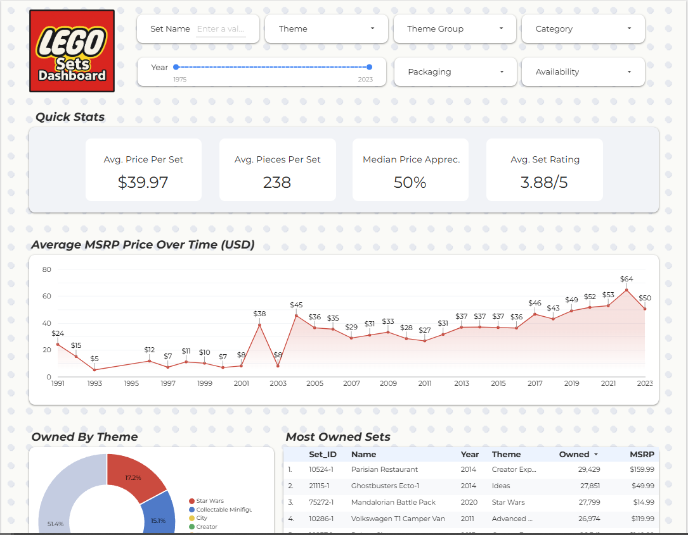
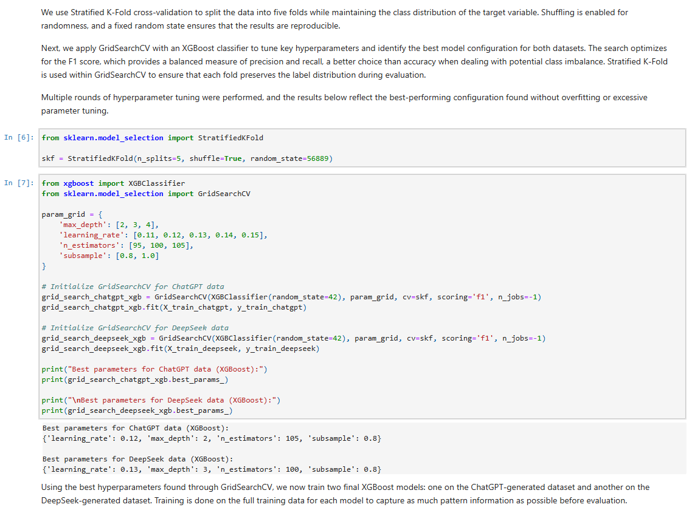
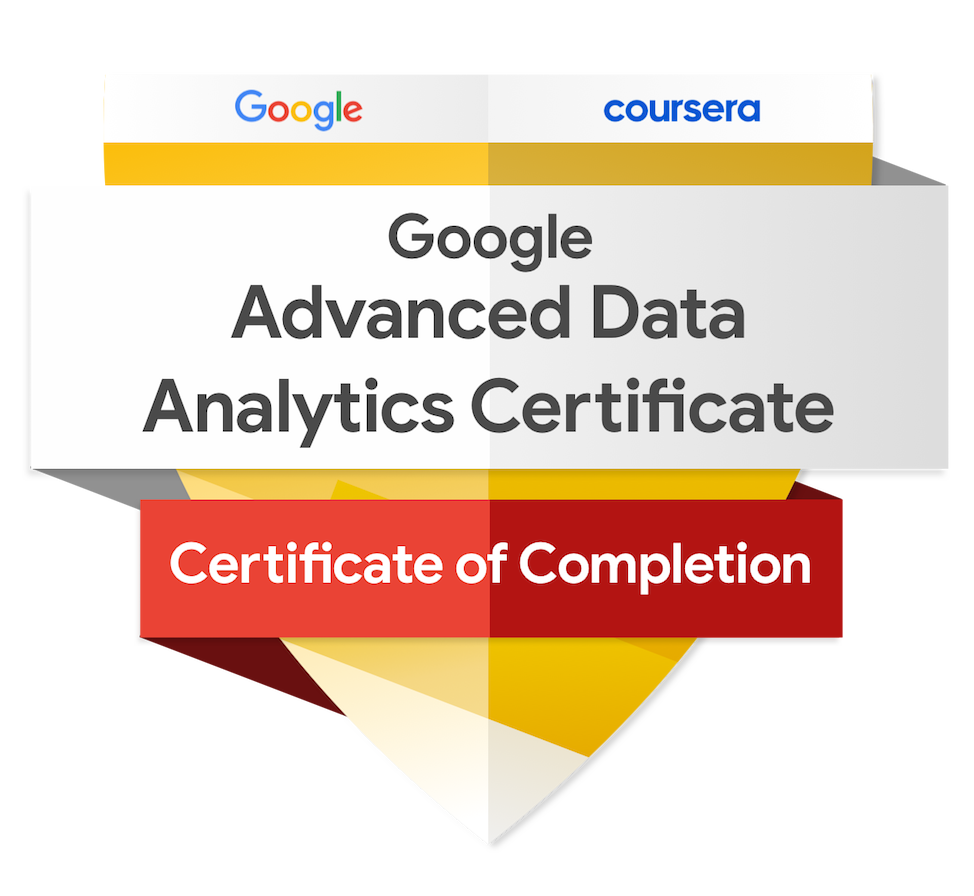

 

# Selected Work
<table align="center">
  <tr>
    <td align="center" width="500">
      

        
         
        <b>Looker Studio</b>
         
         
        <small>
          <b>
            <a href="https://lookerstudio.google.com/s/qs5JoyHwYcw" target="_blank" style="text-decoration:none; color:inherit;"> Lego Sets Interactive Dashboard </a>
          </b>
        </small>
         
         
         
        
        
        
      

    </td>
    <td align="center" width="500">
      

        
         
        <b>Python Notebook</b>
         
         
        <small>
          <b>
            <a href="https://nbviewer.org/github/naji-naji/Exploring-AI-Bias-Through-SHAP-Based-Interpretation-of-a-Machine-Learning-Model/blob/main/case_study_notebook.ipynb" target="_blank" style="text-decoration:none; color:inherit;"> Exploring AI Bias Through SHAP-Based Interpretation of a Machine Learning Model </a>
          </b>
        </small>
         
         
        
        
      

    </td>
  </tr>
</table>
 

<h2 align="center">Certificates</h2>

  
  

 
# Technical & Analytics Skills

## Programming & Data
* **Languages:** Python, SQL, JavaScript
* **Tools & Environments:** Jupyter, REST APIs, Webhooks, Advanced Spreadsheets
* **Data Proficiency:** Data Cleaning, Data Visualization, Statistical Analysis, Hypothesis Testing
* **Modeling:** Machine Learning (ML), Predictive Models, Regression Models
* **Business Intelligence (BI):** Dashboards, Looker Studio, Tableau, Business Intelligence

## Project & Business Acumen
* **Management:** Project Management, Budget Management, Vendor Management
* **Strategy:** Process Optimization, Client Retention, Cross-Functional Leadership
* **Project Management:** Jira, Confluence, Notion, Monday.com, Trello
* **Productivity:** Google Sheets, Microsoft Excel, PowerPoint

<!--
     Thanks for being my guest <3
-->
